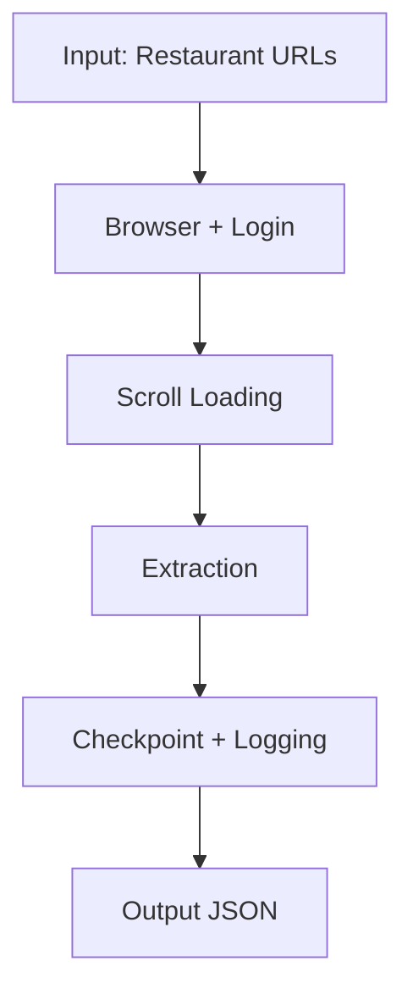

# Foody Review Scraping Pipeline  
*A Large-Scale, Login-Aware Web Data Collection Framework for Restaurant Reviews*

---

## Abstract

This repository presents a scalable web scraping pipeline for collecting large-scale restaurant review data from Foody.vn. Unlike traditional crawlers, the system accounts for **authentication constraints, dynamic content loading, and anti-scraping mechanisms** by integrating browser-based interaction with controlled user simulation. The pipeline supports **checkpointing, fault tolerance, and resumability**, enabling efficient collection of hundreds of thousands of reviews across thousands of restaurants.

---

## 🎯 Objective

The goal of this project is to construct a **high-quality review dataset** for downstream tasks such as:

- Sentiment analysis  
- Recommendation systems  
- User behavior modeling  
- Natural language processing on user-generated content  

---

## System Design

### 1. Authentication-Aware Crawling
- Requires manual login via a real browser session  
- Ensures access to full review data  

### 2. Dynamic Content Handling
- Simulates real user behavior (scrolling, delays)  
- Extracts client-side rendered reviews  

### 3. Scalability & Robustness
- Checkpoint-based progress tracking  
- Resume after interruption  
- Automatic retry on failures  

### 4. Data Consistency
- Structured JSON output  
- Unified schema across all entries  

---

## Pipeline Overview


---

## Dataset Description

- **Domain:** Restaurant reviews (Hanoi, Vietnam)  
- **Scale:**
  - ~7,500 restaurants  
  - Hundreds of thousands of reviews  

### Attributes:
- Review ID  
- User ID  
- Restaurant ID  
- Rating  
- Content  
- Timestamp  

---

## Data Format

```json
{
  "url": "...",
  "review": [
    {
      "ID": "...",
      "RestaurantID": "...",
      "UserID": "...",
      "Rating": "...",
      "Content": "...",
      "CreatedAt": "..."
    }
  ],
  "initData": {}
}
```

## Experimental Protocol

### Step 1: Validation (Mandatory)

```bash
python3 test_review.py
```
- Login when prompted
- Press ENTER after successful login
- Check output in:
  `data/test_review_result.json`

❗ If reviews ≤ 13 → login failed

### Step 2: Full Scraping

```bash
python3 scrape_review_advanced.py
```

---

## Important Constraints
- Requires manual login via browser
- Headless mode is not supported
- Without login → only ~13 reviews per restaurant

## Performance
- Runtime: ~4–6 hours
- Output size: ~300–500 MB
- Scale: 100k+ reviews

## Limitations
- Manual login required
- Sensitive to UI changes from Foody.vn
- Requires controlled interaction speed

## Future Work
- Session-based authentication automation
- Distributed scraping
- Integration with ML pipelines

## Use Cases
- Sentiment analysis
- Recommendation systems
- Behavioral analytics
- Vietnamese NLP research

## Reproducibility

```bash
# Install dependencies
pip install playwright
python -m playwright install chromium

# Run test
python3 test_review.py

# Run full pipeline
python3 scrape_review_advanced.py
```

## Key Requirement

- Scraping Foody requires:

✅ Real login
✅ Real browser
✅ Real scrolling

❗ Missing any → invalid results